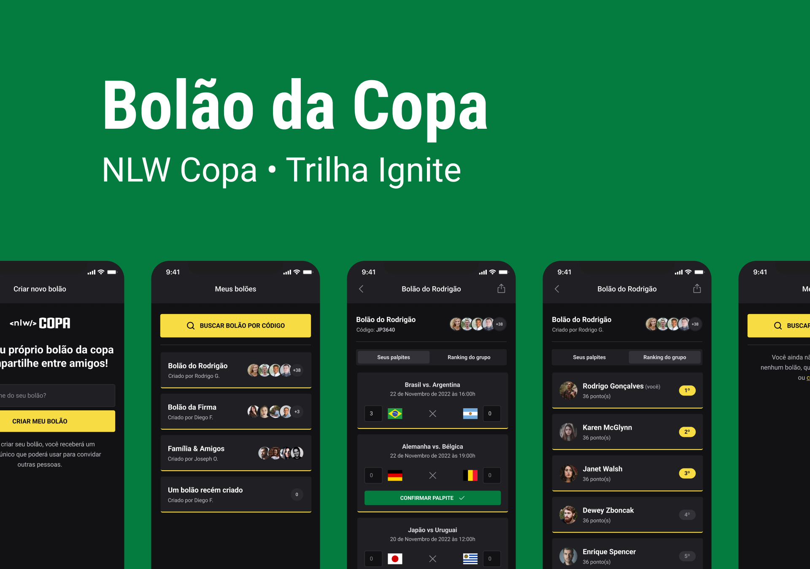

## Next Level Week (NLW) Copa - Trilha Ignite | Rocketseat 




## Goal

**NLW Copa** é o projeto desenvolvido durante a trilha Ignite da **Next Level Week**, um evento online produzido pela [**Rocketseat**](https://github.com/Rocketseat).

O projeto consiste em uma aplicação com a temática da copa, que permitirá os usuários criarem seus próprios bolões da copa e compartilhá-los com seus amigos.

## Tools and techs

- React
- React Native
- Node
- Typescript
- Fastify
- Prisma
- Nextjs
- Expo
- Native Base
- Insomia
- Zod
- Google Cloud

-------------------------------------------------------------------

## Run

```bash 
# Clonar este repositório
$ git clone (this repo)
# Acessar o projeto no terminal
$ cd nlw-copa-ignite
# Acessar a pasta "server"
$ cd server
# Instalar as dependências
$ npm install
# Executar o servidor em modo de desenvolvimento
$ npm run dev
# O servidor será executado na porta 3333 (http://localhost:3333)
```
-------------------------------------------------------------------
### _Executar a plataforma Web_
- [React](https://pt-br.reactjs.org/)
- [NextJs](https://nextjs.org/)
- [TypeScript](https://www.typescriptlang.org/)
- [TailwindCss](https://tailwindcss.com/)

```bash 
# Acessar a pasta "web"
$ cd web
# Instalar as dependências
$ npm install
# Executar a plataforma em modo de desenvolvimento
$ npm run dev
# A plataforma será executada na porta 3000 (http://localhost:3000)
```

-------------------------------------------------------------------
### _Executar o aplicativo Mobile_
- [Expo](https://expo.io/)
- [React Native](https://reactnative.dev/)
- [Native Base](https://docs.nativebase.io/installation)
- [TypeScript](https://www.typescriptlang.org/)

```bash 
# Acessar a pasta "mobile"
$ cd mobile
# Instalar as dependências
$ npm install
# Executar o aplicativo em modo de desenvolvimento
$ npx expo start
```